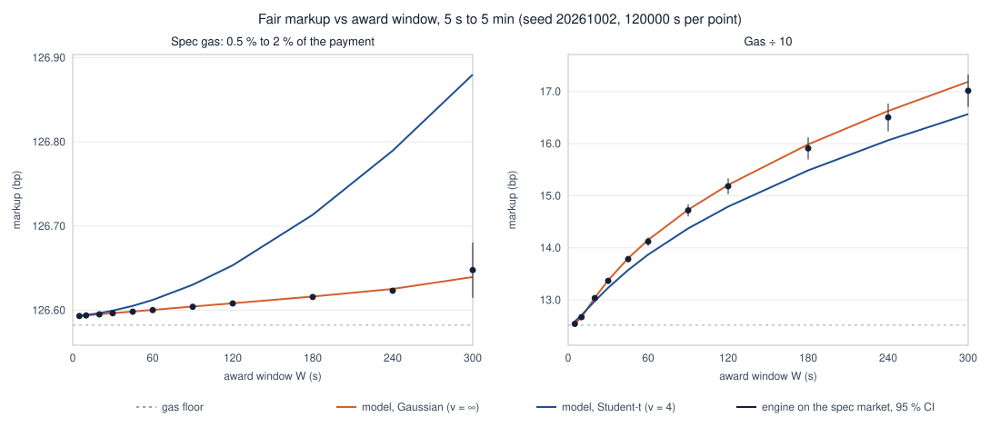

# Settler Quote Engine

A firm quote that cannot be withdrawn is an option given away for free. This repo prices it, in Rust. The brief is in [Takehome_Settler_Quote_Engine.md](Takehome_Settler_Quote_Engine.md). The required chart is below; an interactive version of the same model, to move the parameters live, is at **[doradelta.github.io/settler_task](https://doradelta.github.io/settler_task/)** (`docs/index.html`).

| File | Part | What it does |
|---|---|---|
| `src/pricing.rs` | B | the break-even price for a quote held W seconds |
| `src/engine.rs` | A | auction in, quote or decline out; only quotes what it can fund |
| `src/sim.rs` | C | runs the engine against the brief's market and measures where it breaks even |
| `src/chart.rs`, `src/main.rs` | C | the table, `results/curve.csv`, the chart and `docs/data.js` |

## Pricing the time in a firm quote

When we quote, we promise a price for W seconds and the originator decides whether to take it. That is a call option on the exchange rate: the strike is our price, it expires when the window closes, and nobody pays us for it. Seven in ten originators accept at a random moment without looking at the market. Three in ten wait and accept only if the market has moved past our price, which is exactly when we lose. The break-even price:

```math
Q^{*} \;=\; \frac{\underbrace{R_0}_{\text{rate now}}}{\,1 \;-\; \underbrace{g}_{\text{gas}} \;-\; \underbrace{\dfrac{p\,\big(v + q\,g\big) + c}{1-p}}_{\substack{\text{what the informed take, plus capital,}\\ \text{paid by the uninformed}}}\,}
```

*Today's rate, marked up by everything a quote costs us, as a share of the payment.*

```
Q*   the break-even price: the lowest quote that does not lose money on average
├── R₀   the market rate when we quote
├── g    gas, the fee we pay on every delivery: 1.25 % of the payment
│        on its own it sets a floor of 126.6 bp above the market
├── p    the share of informed originators: 30 %
│        their losses are spread over the other 70 %, the ones who actually pay us
├── v    the option we give away: how far, on average, the rate ends above our price
│        it grows with volatility (2 bp per second) and with the window (5 s to 5 min),
│        allows for fat tails (large moves happen more often than a bell curve says)
│        and is priced with Bachelier, the standard formula for very short options
├── q    the chance that an informed originator takes the quote;
│        when they do, we also pay the gas
└── c    the cost of the money we tie up until we are paid back: about 0.01 bp
```

The option and that chance both depend on our own price (a higher price makes the option cheaper), so the code finds the break-even price by trial and error (`src/pricing.rs`).

<details>
<summary>The exact formula behind v and q, for the curious</summary>

With m = Q\*/R₀ − 1 the markup, the move over the window is r = c·T with T Student-t(ν) and c = σ√W·√((ν−2)/ν), so its variance is σ²W. With a = m/c: E[(r − m)⁺] = c·[(ν + a²)/(ν − 1)·f_ν(a) − a·(1 − F_ν(a))], q = 1 − F_ν(a) and v = E[(r − m)⁺]/(1 + m). As ν → ∞ this is the Gaussian Bachelier call. In the code R₀ also carries the brief's small upward drift (0.03 bp at 300 s).
</details>

We use fat tails as a placeholder for a market we have not seen; against the brief's bell-curve market they over-charge by 0.24 bp at 5 minutes and by nothing at 5 seconds. In production the volatility would be measured live, and the share of informed originators estimated from which quotes get taken at the last second. On a stablecoin corridor, where the rate barely moves and is pulled back, the window would cost almost nothing (there is a slider for this on the interactive page).

**The curve.** Lines: what the model says. Dots: what the engine actually earns when run against the brief's market (120,000 simulated seconds per point, seed 20261002).



| Window | 5 s | 60 s | 300 s |
|---|---|---|---|
| model, bell curve (bp) | 126.593 | 126.600 | 126.640 |
| model, fat tails (bp) | 126.593 | 126.612 | 126.880 |
| engine on the brief's market (bp) | 126.593 ± 0.0002 | 126.600 ± 0.0005 | 126.648 ± 0.033 |

Why it is flat: the brief's gas forces a 126.6 bp markup, which puts our price far above where the rate can realistically go in five minutes (about 35 bp). The informed originator almost never finds the quote worth taking, so a 5-minute window adds only 0.05 bp, and most of that is not the option but a small upward drift built into the brief's rate. With fat tails the option is worth a little more: 0.25 bp at 5 minutes. With gas ten times cheaper our price sits close to the market and the window costs real money: from 12.5 bp at 5 seconds to 17.2 bp at 5 minutes. At the brief's gas the curve would only start bending upward at windows of about 16 minutes, or 4 minutes if volatility doubled.

**How we know the numbers hold.** The engine's dots match the model at every window, within their error bars. At the brief's gas the informed almost never take a quote (not once below 4 minutes in this run), so those dots mostly check the gas and the drift; the cheap-gas panel, where they take quotes thousands of times, checks the option itself.

## Beyond break-even: hedging, alone or competing

The break-even price is where we neither win nor lose on average. To make money we quote above it, and how far depends on whether anyone else is quoting. Profit comes first: we are competitive only while it pays.

```math
Q \;=\; \max\!\Big(\underbrace{Q^{*}\big(1 + z\,\frac{\sigma_{\text{fill}}}{\sqrt{n}}\big)}_{\text{floor}},\;\; \min\!\big(\underbrace{Q^{*}\,(1 + 1/\beta)}_{\text{alone}},\; \underbrace{Q_{\text{rival}} - \varepsilon}_{\text{competing}}\big)\Big)
```

*Never below break-even plus a small safety margin; alone, as high as customers accept; competing, just under the best rival.*

```
Q   the price we actually quote
├── floor       break-even plus a safety margin we never give up: about 1.4 bp
│               sized so that about 99 days in 100 are profitable at ~5,000 fills a day;
│               it is small because, once the rate risk is hedged, what is left
│               (mostly the randomness of gas) averages out over many fills
├── alone       with no rival: the highest price customers still accept
│               β says how many fills we lose per extra bp of markup; it is measured,
│               e.g. losing 5 % of fills per bp gives 20 bp above break-even
└── competing   one tick under the best rival's price;
                if that would be below our floor, we let the rival win
```

**Hedging.** When we quote, we buy the destination units we expect to deliver: all of them for the uninformed, part of them for the informed, more as the rate approaches our price. Then a market move does not hit every open quote at once. Hedging makes results steadier; it does not make money, and it cannot remove the cost of the option: if we buy everything up front, we lose instead when the informed walk away after the rate has fallen.

This section is not simulated (the brief's market has no rivals, and its uninformed originators ignore the price); its numbers are rough orders of magnitude.

## Concurrency (Part A)

Every open quote sets aside its full payment, and an accepted one stays set aside until we are paid back, so the engine only quotes what it can fund: with money for 10 payments and 50 auctions, auctions 11 to 50 are declined (a test in `src/engine.rs`). We never promise money we do not have. With one payment size there is nothing more to optimise unless the protocol puts a price on failing to pay; then we could safely quote a little more than we can fund, since about 30 % of quotes are never taken. The window still matters here: a longer window keeps money set aside longer, so the same money completes fewer payments per second.

## Run

    cargo test --release     # 11 tests
    cargo run --release      # prints the table, writes results/, chart/ and docs/data.js (about 4 s)

## Notes

- **What to monitor in production:** for every accepted quote, how far the rate moved against us afterwards, split by when it was taken. Quotes taken at the last second are the informed ones, which tells us their share. Also live volatility, and whether we really break even where the model says.
- **Polygon vs Solana:** the same price, but Polygon keeps our money locked about 4 minutes after each payment and Solana about 13 seconds, so with a one-minute window the same money completes about 4.5 times fewer payments on Polygon.
- **Missing from the protocol:** cancelling or re-pricing a live quote (it would remove the option altogether), a published penalty for failed payments (it would let us safely quote more than we can fund), and originator identity (it would let us spot the informed).
- **With more time:** quote above capacity once a penalty exists, and simulate rare large moves more efficiently, so the 5-minute point at the brief's gas is checked properly.

## Assumptions

For pricing, fat-tailed moves (Student-t, ν = 4); for the simulation, the brief's own bell-curve rate. Ethereum timings: 24 s to deliver, 144 s until we are paid back. Money costs 10 % a year. Each auction's hard deadline is up to an hour away (the brief gives none). The settler is risk-neutral, uninformed originators ignore the price, one corridor.
