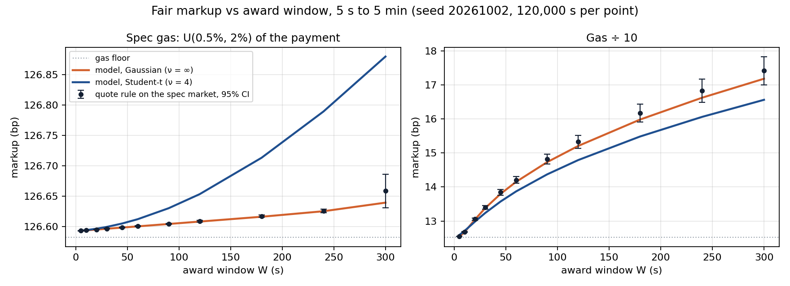

# Settler Quote Engine

A firm quote that cannot be withdrawn is an option written for free. This repo prices it, and decides how many such quotes to keep live on finite inventory. The brief is in [Takehome_Settler_Quote_Engine.md](Takehome_Settler_Quote_Engine.md); every chart below is interactive at **[doradelta.github.io/settler_task](https://doradelta.github.io/settler_task/)** (`docs/index.html`, no build step).

We read the brief as two different problems and keep each to its simplest correct form.

## 1 · Pricing the time in a firm quote

A quote at price Q = R₀(1+m), held for W seconds, hands the originator a call on the rate: strike K = 1+m, expiry W, premium zero. On a fill we earn N·(1 − X/K) − gas, with X = R_exec / R₀.

- **Uninformed originators (70 %)** award at a random time whatever the price, so E[X] ≈ 1 and they only need to pay for gas: m_G = Ḡ / (N − Ḡ) = **126.6 bp** (the spec's gas is 1.25 % of a payment).
- **Informed originators (30 %)** award only if the rate beat our price: a short call. We give the return r a standard deviation σ√W and a **Student-t shape** with ν degrees of freedom, variance-matched (a t is a Gaussian whose variance is uncertain; ν says how well we know σ over the window, and ν = ∞ is the Gaussian the spec simulates):

  E[loss] = (N/K)·E[(r − m)⁺] + Ḡ·P(r > m), E[(r − m)⁺] = c·[(ν + a²)/(ν − 1)·f_ν(a) − a·(1 − F_ν(a))], a = m/c, c = σ√W·√((ν−2)/ν).

- **Break-even:** (1−p)·E[profit | uninformed] + p·E[profit | informed] − carry = 0, where carry is the cost of capital while the payment is reserved, then locked. m is both the revenue and the strike, so this is a fixed point; it is monotone in m, so one bisection solves it (`settler/pricing.py`).

For a pinned corridor (stablecoin to stablecoin) the rate mean-reverts instead of wandering; that only replaces σ²W by σ²(1 − e^(−2κW))/2κ (`Market.mean_reversion`, an OU process) and caps the price of time at the reversion horizon. The spec's market is a random walk, κ = 0, and so is everything below.

We quote ν = 4 as a placeholder for a tape we have not seen (finite variance, infinite kurtosis, where minute-scale crypto returns tend to sit); against the spec's Gaussian it over-charges 0.24 bp at 300 s and nothing at 5 s. What a desk adds on top: σ from an EWMA of the tape (`realized_sigma`, written, not needed by the spec run); p, q and ν from **markouts** of quotes (walk-aways plus awards at the deadline give p, their ratio gives q, the depth of the deadline markouts picks ν); the tail stays in closed form, no Monte Carlo at quote time.

**The curve.** Lines: the model. Dots: the engine's quote rule run against the specified Gaussian market, 120,000 s per point, seed 20261002 (vectorised, identical to the event loop; antithetic paths; gas at its known mean):

| W | 5 s | 60 s | 300 s |
|---|---|---|---|
| model, Gaussian (bp) | 126.593 | 126.600 | 126.640 |
| model, Student-t ν = 4 (bp) | 126.593 | 126.612 | 126.880 |
| quote rule on the spec market (bp) | 126.593 ± 0.000 | 126.601 ± 0.001 | 126.659 ± 0.028 |

Why it is flat: gas puts our price 126.6 bp above the market while the rate moves 35 bp in five minutes, so the informed originator needs a 3.6σ move and the option is worth 0.01 bp. Of the +0.05 bp from 5 s to 5 min under the Gaussian, 0.03 is the spec's drift (exp(σZ) steps have mean exp(σ²/2)), 0.005 is carry and 0.012 is the option; under t(4) the option alone is 0.25 bp, 20× the Gaussian figure. The expected markout of an informed fill, C/q, is 8 bp under the Gaussian and 46 bp under t: the number a desk watches. Divide gas by ten and the strike sits 0.5σ away: the premium over the floor climbs 0.03 → 4.7 bp, explosively while the strike is still 2–3σ out and about like W^0.65 after a minute, and there the variance-matched t is *cheaper* (16.6 vs 17.2 bp), because matching the variance thins the body to fatten the tail; fat tails cost more only once the strike is past ≈1.15σ for the call itself, ≈1.5σ with the gas paid on exercise. The spec curve starts to bend at W ≈ (ln K / 2σ)² ≈ 16 min, 4 min if σ doubles.

**Stability.** The ± is a 60-batch t-interval; below 2 min it is a true 95 % CI and the Gaussian model sits inside it at every point. At spec gas an informed exercise needs a 3.6σ move inside a 300 s window, so the run saw none for W ≤ 240 s and 55 at W = 300 s, all on one path in three batches: that panel verifies gas, drift and carry, and its 300 s interval is indicative (across 30 seeds the point moves ±0.014 bp around the model). The option term is verified on the gas ÷ 10 panel, where every point has thousands of exercises and coverage is nominal.

## 2 · Finite inventory, many live quotes

Each live quote reserves one payment; an award locks it until release. With capacity C and n live quotes, let A be the number awarded: uninformed quotes always fill; informed ones watch the same rate path, so we take the conservative extreme and let them fill together with probability q or not at all. The policy chooses n to

  maximise  n·p_fill·margin − F·E[(A − C)⁺],  F = all-in cost of an award we cannot fund (penalty plus the margin we hand back).

Does convex optimisation fit? Yes, in the useful sense: the n-th quote adds ΔE_n = q·1{n > C} + (1−p)(1−q)·P(Bin(n−1, 1−p) ≥ C) expected unfunded awards, non-decreasing in n, so the objective is concave and no solver is needed. The optimum is a newsvendor critical fractile: **keep quoting while p_fill·margin ≥ F·ΔE_n** (`Inventory.max_live`; at q = 0 this is the classic margin ≥ F·P(Bin(n−1, p_fill) ≥ C)). F = ∞ gives hard reservation, n = C, never a naked quote; that is our default because the protocol publishes no penalty. With a 10 bp margin and F = 1 % of notional, n* = 11 on 10 free slots: +4 % throughput at W = 300 s and 0 unfunded fills in 20,000 s. The correlation matters: at gas ÷ 10, where q ≈ 0.27 (0.31 under the Gaussian), the same formula gives n* = 10, because the informed exercise together exactly when those fills lose money.

Where convex programs do appear: several corridors sharing one pool of capital is an LP (maximise Σ marginᵢ·xᵢ subject to Σ occupancyᵢ·xᵢ ≤ C, dual = the shadow price of a slot-second); heterogeneous payments make it an MDP whose bid prices play the role of F. Neither is needed for one corridor.

The window is a throughput lever, not a price, whenever auctions outrun capacity (here the desk declines 96 % of them at W = 5 s). Capacity 10, hard reservation, engine against the closed form C·p_fill / (held + 1/λ):

| W | 5 s | 60 s | 300 s |
|---|---|---|---|
| fills / s | 0.058 | 0.044 | 0.024 |
| closed form | 0.058 | 0.045 | 0.022 |
| utilisation | 97 % | 75 % | 40 % |

Even at break-even the window has an inventory price: keeping profit per slot-second constant needs margin(W) = margin(5 s) × cycle(W)/cycle(5 s) = 2.6× at 300 s on Ethereum, so a 5 bp desk margin becomes 13 bp, two orders of magnitude above the option.

## Run

    pip install -r requirements.txt      # Python 3.9+, numpy, scipy, matplotlib, pytest
    python3 -m pytest -q                 # 16 tests, under a second
    python3 run.py                       # results/, docs/data.js, chart/  (about 7 s)

## Notes

- **Instrument:** markouts of awarded quotes by time-to-award (walk-aways plus the deadline spike give p, their ratio q), realised σ against the EWMA, and realised break-even minus quoted markup with a CI.
- **Polygon vs Solana:** same price (carry < 0.02 bp on either chain) but 256 s vs 13 s of locked capital: at W = 60 s the same corridor turns inventory 4.5× slower on Polygon (14× at 5 s, under 2× at 5 min, where the window itself dominates the cycle), and if rebalancing happens at release the rate variance over the lock is 20× larger.
- **Missing from the protocol:** cancel or re-price a live quote (kills the option), a published penalty for failed fulfilment (prices overbooking), originator identity (p per counterparty).
- **With more time:** replace the all-or-nothing informed correlation by the true overlap correlation of concurrent windows; put the slot shadow price from §2 into the quote as a per-slot-second charge; importance-sample the informed tail so the spec-gas option is verified at 300 s instead of waiting for a rare cluster.

## Assumptions

Student-t(ν = 4) for the quote, the spec's Gaussian process (uncorrected log steps, +0.035 bp at 300 s) for the simulation. Ethereum: L = 2 blocks (24 s), lock = 12 blocks (144 s). Cost of capital 10 %/yr. Fulfilment deadlines U(0, 1 h) ahead, since the spec gives none. The one-step overbooking rule ignores slots released inside the window, so it is conservative for W > 168 s. Risk-neutral settler, price-inelastic uninformed demand, one corridor.
